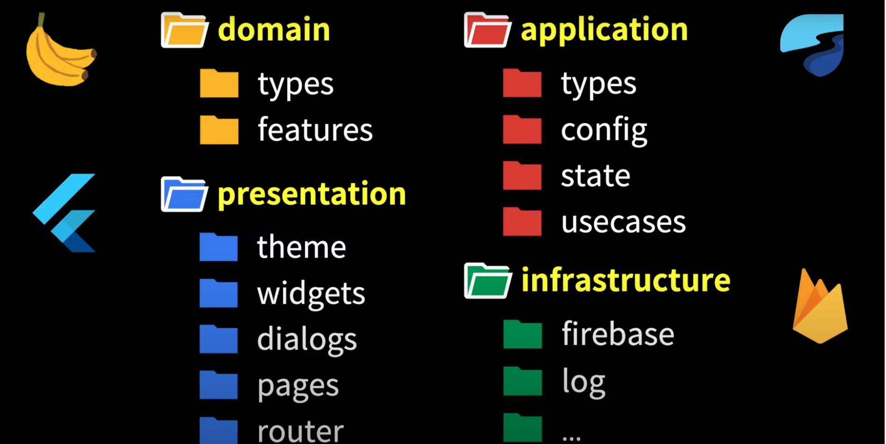

# kurasuke

授業スケジュールを自動で組みます！！

## 開発

### ディレクトリ構成

```
(抜粋)
.
├── analysis_options.yaml // linter の設定
├── assets // 画像とかフォントとか格納する
├── lib // 基本的にこのディレクトリ配下で開発する
│   ├── application // アプリケーション層
│   ├── domain // ドメイン層
│   ├── infrastructure // インフラ層
│   ├── main.dart // エントリポイント
│   └── presentation // プレゼンテーション層
├── pubspec.yaml // パッケージ管理
├── scripts
│   ├── build_runner.sh // コードを自動生成する
│   └── run_dev.sh // 開発モードで実行
└── test // テストコード
```

lib/ 配下について説明する.
各層については, オニオンアーキテクチャの言葉を持ってきている.



[ルビーdogの動画](https://www.youtube.com/watch?app=desktop&v=UMpInO2giz4&ab_channel=%E3%83%AB%E3%83%93%E3%83%BCDog) を見るべし.

#### application

TODO: メモ書く

```
├── application
│   ├── config
│   │   ├── flavor.dart
│   │   └── memo.dart
│   ├── di
│   │   ├── infrastructure.dart
│   │   └── usecases.dart
│   ├── interfaces
│   │   ├── firebase.dart
│   │   └── logger.dart
│   ├── state
│   │   ├── editting_memo_notifier.dart
│   │   ├── editting_memo_provider.dart
│   │   ├── memo_list_notifier.dart
│   │   └── memo_list_provider.dart
│   ├── types
│   │   ├── analytics_event.dart
│   │   └── flavor.dart
│   └── usecases
│       ├── add_memo.dart
│       ├── delete_memo.dart
│       ├── init_app.dart
│       └── update_memo.dart
```

#### domain

TODO: メモ書く

```
├── domain
│   ├── features
│   │   ├── memo_creator.dart
│   │   ├── memo_updater.dart
│   │   └── memo_validater.dart
│   └── types
│       ├── memo.dart
│       ├── memo.freezed.dart
│       ├── memo_config.dart
│       └── status.dart
```

#### infrastructure

TODO: メモ書く

```
├── infrastructure
│   ├── firebase
│   │   ├── fake_firebase.dart
│   │   ├── firebase.dart
│   │   └── firebase_options.dart
│   └── log
│       ├── fake_logger.dart
│       ├── log.dart
│       ├── log_level.dart
│       └── logger.dart
```

#### presentation

TODO: メモ書く

```
└── presentation
    ├── dialogs
    │   └── warn.dart
    ├── pages
    │   ├── edit.dart
    │   └── list.dart
    ├── router
    │   ├── app.dart
    │   ├── go_router.dart
    │   └── page_path.dart
    ├── theme
    │   ├── colors.dart
    │   ├── fonts.dart
    │   ├── images.dart
    │   ├── l10n.dart
    │   └── sizes.dart
    └── widgets
        ├── add_button.dart
        ├── delete_button.dart
        ├── gap.dart
        ├── memo_card.dart
        ├── save_button.dart
        ├── status_button.dart
        ├── status_image.dart
        ├── status_text.dart
        └── text_edit_form.dart
```
